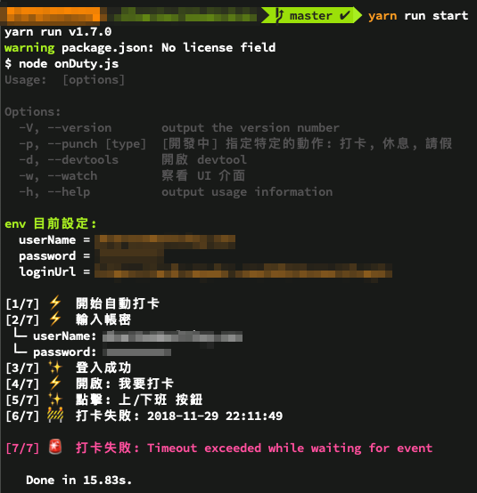
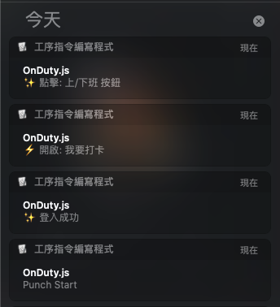
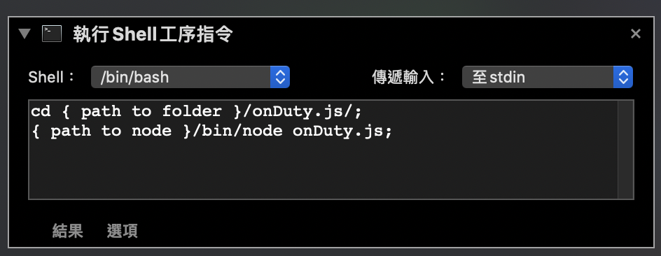

# onDuty.js

### DEMO


### Install
1. Install dependencies package
`npm install` or `yarn install`

2. Set login info
  - Copy **.env.example** to **.env**
  - Set your **username** and **password** in `.env`


### Run
For NPM:
Command: `npm run start` or enter command `npm run` to list all options.

For NPM:
Command: `yarn start` or enter command `yarn run` to list all options.

### Help
Enter `npm run start --help` or `yarn start --help` to list argv.

```
-p, --punch [type]: [開發中] 指定特定的動作: 打卡, 休息, 請假
-d, --devtools: 開啟 devtool
-w, --watch: 察看 UI 介面
```

### Usage
[onDutySchedule](https://github.com/PhantasWeng/onDutySchedule) - A Timer for punch apollo XE

### With osascript
You will get notifications when punching. and a result alert with status at the end of process.


### Mac Automator
Create Automator script - shell workflow

```
cd {to-your-folder};
{node path}/node onDuty.js;
```

Then, make script to app.
After all, you can map your keyboard shortcut or any key to open the app.

Automator will give a punch and tell you if success or not.



## TODO
- Message on Automator start.
- Progress/Rolling status.
- Argument of GUI.
